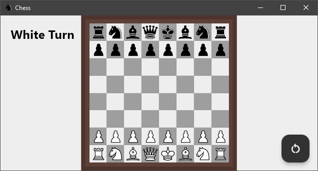
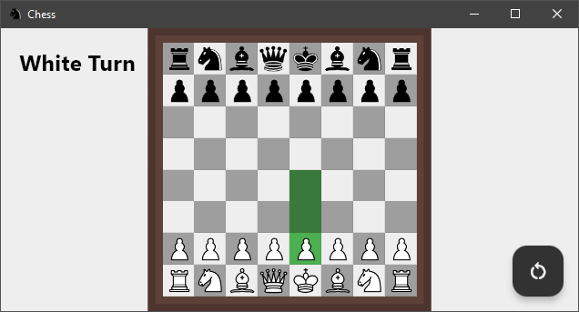
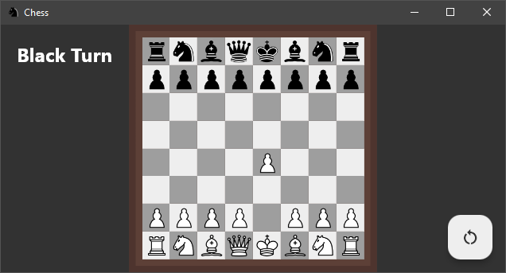
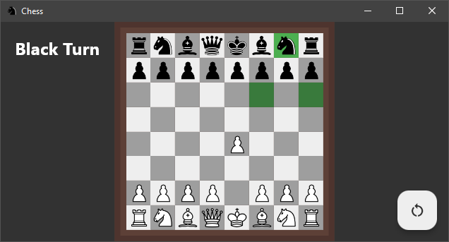
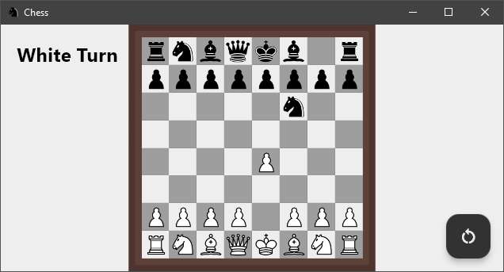
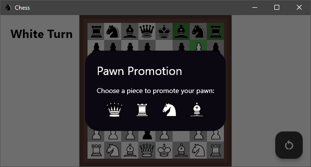
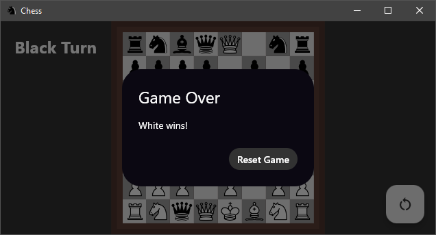

# Chess Game

A two-player offline chess game implemented using Flutter and Dart, specifically designed for desktop applications. This application allows users to play a full game of chess with a standard chessboard and all the standard rules, including pawn promotion, check, and checkmate detection.

## Features

- Standard 8x8 chessboard
- Complete set of chess pieces for both white and black players
- Turn-based play with visual indicators for the current player
- Move validation and highlighting of valid moves
- Capture and promotion of pawns
- Check for checkmate and display the winner
- Reset game functionality
- Customizable window with specific size 


## Screenshots









## Run Locally

Clone the project

```bash
  git clone https://github.com/Codingbhava/chess.git
```

Go to the project directory

```bash
  cd chess
```

Install dependencies

```bash
  flutter pub get
```

Run the application

```bash
  flutter run
```


## Build Window application

To Build Window application, run the following command

```bash
  flutter build windows
```


## Download Executable (Windows)


If you don't want to build from source, you can download the pre-built executable.

Go to the [Releases](https://github.com/Codingbhava/chess/releases) page.

Download the latest chess.exe file.

Run the downloaded chess.exe file to start playing.
## Acknowledgements

 - [Flutter](https://flutter.dev/)
 - [Dart](https://dart.dev/)
 

## 🚀 About Me
I am passionate about building innovative solutions and exploring new technologies to create impactful applications.

Enjoy playing chess! If you have any questions or need further assistance, feel free to contact me at 

[](https://Instagram.com/codingbhava)
[](https://github.com/Codingbhava)

Happy Playing!